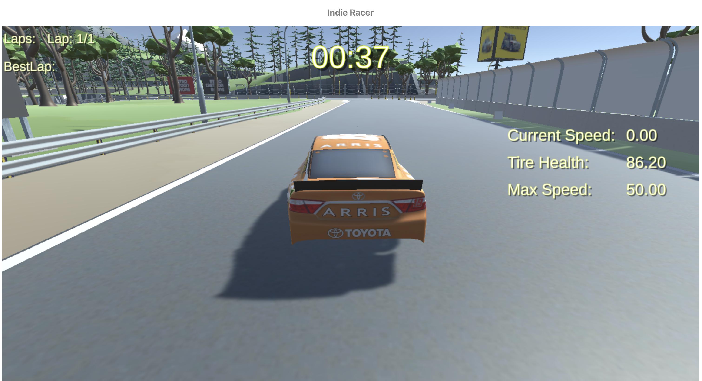

# Indie Racer

## BACKEND REPO: https://github.com/Indie-Racer-Polkadot/unique-racing-api

Our project employs a sophisticated tech stack that harnesses the power of blockchain technology, particularly focusing on Polkadot and its parachains, to deliver an advanced gaming experience. At the core of our architecture is Unity, a versatile game development platform that was used to create and export the game to the web, integrating seamlessly with React for a responsive and interactive user interface. The wallet connection is facilitated through Unique Network, a specialized parachain on the Polkadot ecosystem, which offers robust and secure authentication mechanisms.

Polkadot's unique features, such as interoperability and shared security, played a pivotal role in our project's development. By utilizing Unique Network, we leveraged its dedicated NFT capabilities, which are optimized for creating and managing non-fungible tokens. This parachain's customizability allowed us to tailor the NFT features to align perfectly with our game's requirements, ensuring that each NFT is a dynamic and accurate reflection of a player's in-game progress.

The backend of our project is powered by Node.js, ensuring efficient handling of API calls and real-time data updates. Polkadot's scalability and efficient transaction processing enabled us to handle these updates smoothly, maintaining high performance even under heavy load. The cross-chain functionality inherent to Polkadot’s ecosystem allowed us to seamlessly integrate various components, ensuring that data flows effortlessly between the game, the blockchain, and our backend systems.

By leveraging Polkadot's advanced features and Unique Network’s specialized capabilities, we created a secure, scalable, and dynamic gaming environment. This setup not only ensures the integrity and uniqueness of each player's NFT but also provides a robust framework for real-time updates and interactions, making our project a pioneering example of blockchain integration in gaming.

In our innovative web-based game developed using Unity and seamlessly integrated with React, we offer a cutting-edge feature that enhances player engagement through the use of unique NFTs. The process begins with the player initiating a wallet connection via Unique Network, ensuring a secure and streamlined authentication experience. Once connected, the game, which has been exported from Unity to the web, allows players to create a unique NFT that is directly tied to their user account. This NFT serves as a dynamic digital asset that evolves with the player's progress in the game.

As players immerse themselves in the gameplay, Unity continuously posts data about their progress to our backend API, meticulously developed using Node.js. This robust backend infrastructure ensures that all gameplay logistics and milestones are accurately captured and reflected in real-time. The NFT associated with the player’s account is then updated to showcase the latest achievements, scores, and other relevant metrics, providing a tangible representation of their in-game accomplishments.

This integration not only personalizes the gaming experience but also leverages the immutable and transparent nature of blockchain technology to offer players a unique and secure digital asset. The NFT can be displayed, traded, or enhanced as players continue their journey, creating a persistent and evolving record of their gameplay that extends beyond the virtual world of the game.
